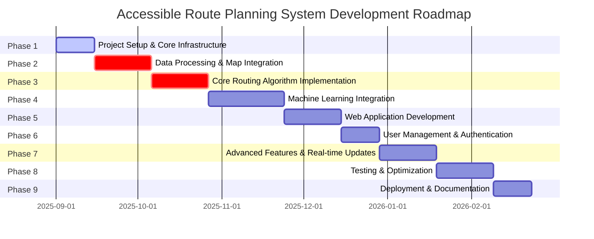
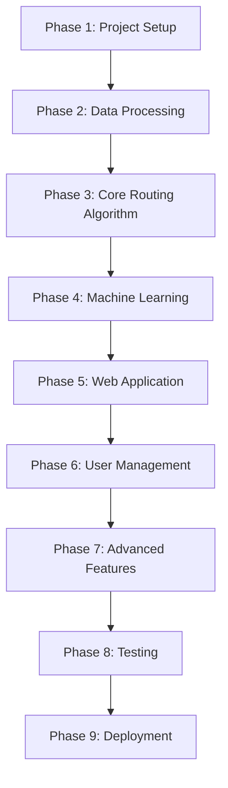

# Project Roadmap for Accessible Route Planning System

## Overview

This document outlines the project roadmap for rebuilding the Accessible Route Planning System. The roadmap shows the timeline, dependencies, and milestones for each phase of development.

## Roadmap Visualization

## Phase Dependencies

## Detailed Phase Timeline

### Phase 1: Project Setup and Core Infrastructure (2 weeks)
**Target Completion:** September 14, 2025

**Key Milestones:**
- Project directory structure established
- Virtual environment configured
- Version control initialized
- Configuration management implemented
- Basic documentation created
- Logging framework set up

### Phase 2: Data Processing and Map Integration (3 weeks)
**Target Completion:** October 5, 2025

**Key Milestones:**
- OSM data downloading implemented
- Accessibility attribute extraction completed
- Map data storage system operational
- Data validation procedures established
- Preprocessing pipelines functional
- Sample data generation tools available

### Phase 3: Core Routing Algorithm Implementation (3 weeks)
**Target Completion:** October 26, 2025

**Key Milestones:**
- Basic A* algorithm implemented
- Multi-criteria cost functions operational
- Personalized routing based on user profiles
- Accessibility constraint filtering working
- Route result data structures defined
- Algorithm testing framework established

### Phase 4: Machine Learning Integration (4 weeks)
**Target Completion:** November 23, 2025

**Key Milestones:**
- ML models for heuristic learning trained
- Dynamic cost function prediction operational
- User feedback collection system implemented
- Model training and evaluation pipelines functional
- Model persistence and loading mechanisms working
- ML model monitoring and updating system operational

### Phase 5: Web Application Development (3 weeks)
**Target Completion:** December 14, 2025

**Key Milestones:**
- Flask application structure established
- Route planning API endpoints operational
- Interactive map visualization implemented
- Route display and comparison features working
- Accessibility overlays and filters functional
- Responsive web interface templates completed

### Phase 6: User Management and Authentication (2 weeks)
**Target Completion:** December 28, 2025

**Key Milestones:**
- User registration and login system operational
- User profile management implemented
- Accessibility preference configuration working
- Session management and security established
- User data privacy features implemented
- Admin panel for system management functional

### Phase 7: Advanced Features and Real-time Updates (3 weeks)
**Target Completion:** January 18, 2026

**Key Milestones:**
- Real-time obstacle reporting system operational
- Community feedback integration implemented
- Route feedback collection and analysis working
- Notification system for route updates functional
- Mobile-responsive design enhancements completed
- Advanced visualization features implemented

### Phase 8: Testing and Optimization (3 weeks)
**Target Completion:** February 8, 2026

**Key Milestones:**
- Comprehensive test suite for algorithms completed
- Performance benchmarking implemented
- Integration tests for web application operational
- User acceptance testing framework established
- Algorithm performance and scalability optimized
- Error handling and recovery mechanisms implemented

### Phase 9: Deployment and Documentation (2 weeks)
**Target Completion:** February 22, 2026

**Key Milestones:**
- Deployment configuration and scripts created
- System monitoring and logging implemented
- Comprehensive user documentation completed
- Backup and recovery procedures established
- System maintenance procedures documented
- Developer documentation and API reference completed

## Resource Allocation

### Development Team
- **Lead Developer:** Overall project coordination
- **Algorithm Specialist:** Routing algorithms and ML integration
- **Frontend Developer:** Web interface and visualization
- **Backend Developer:** API development and data processing
- **QA Engineer:** Testing and optimization
- **DevOps Engineer:** Deployment and infrastructure

### Tools and Infrastructure
- **Development Environment:** Python 3.8+, VS Code, Git
- **Data Processing:** OSMnx, NetworkX, Pandas, NumPy
- **Machine Learning:** Scikit-learn, Joblib
- **Web Framework:** Flask, HTML/CSS/JavaScript
- **Database:** SQLite (development), PostgreSQL (production)
- **Testing:** Pytest, Selenium
- **Documentation:** Markdown, Mermaid

## Risk Management

### Technical Risks
1. **Data Quality Issues:** OSM data may have inconsistencies
   - *Mitigation:* Implement comprehensive data validation and cleaning procedures

2. **Algorithm Performance:** A* algorithm may not scale well
   - *Mitigation:* Implement caching, indexing, and optimization techniques

3. **ML Model Accuracy:** Models may not generalize well
   - *Mitigation:* Implement cross-validation and continuous model improvement

### Schedule Risks
1. **Dependency Delays:** Delays in one phase affecting subsequent phases
   - *Mitigation:* Build buffer time into schedule and implement parallel development where possible

2. **Integration Challenges:** Difficulty integrating components
   - *Mitigation:* Implement continuous integration and regular integration testing

### Resource Risks
1. **Team Availability:** Team members may become unavailable
   - *Mitigation:* Cross-train team members and maintain comprehensive documentation

2. **Tool Compatibility:** Issues with tool versions or compatibility
   - *Mitigation:* Pin dependency versions and regularly update in controlled manner

## Success Metrics

### Technical Metrics
- Algorithm performance (route calculation time < 1 second)
- System availability (99.9% uptime)
- Data accuracy (95% of routes validated as accessible)
- ML model accuracy (R² > 0.8 for predictions)

### User Experience Metrics
- User satisfaction rating (> 4.5/5)
- Route accuracy rating (> 4.0/5)
- Accessibility compliance (100% of routes meet accessibility standards)
- Mobile responsiveness (load time < 3 seconds)

### Project Management Metrics
- On-time delivery (90% of milestones met on schedule)
- Budget adherence (within 10% of projected costs)
- Code quality (code review score > 4.0/5)
- Test coverage (> 80% code coverage)

## Conclusion

This roadmap provides a structured approach to rebuilding the Accessible Route Planning System. By following this phased approach, we can ensure that each component is properly implemented and tested before moving on to the next phase. The timeline allows for approximately 6 months of development, with appropriate buffers for integration and testing.