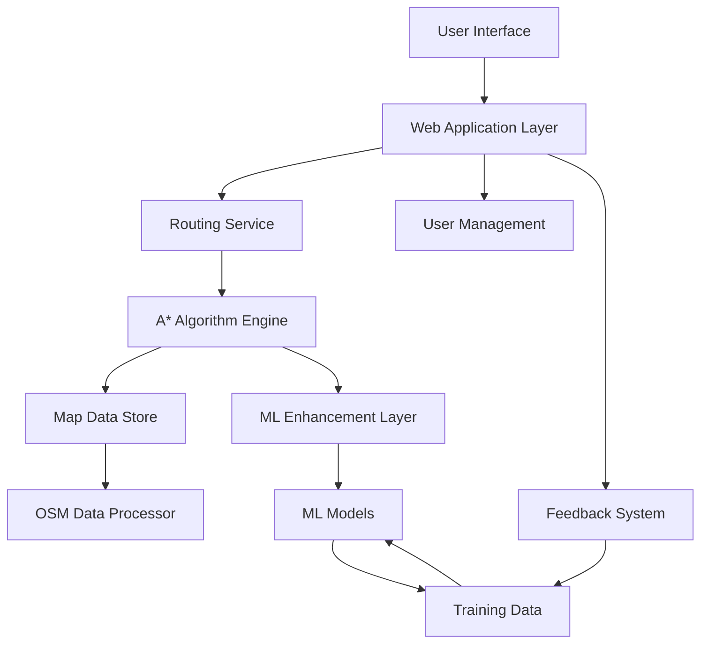
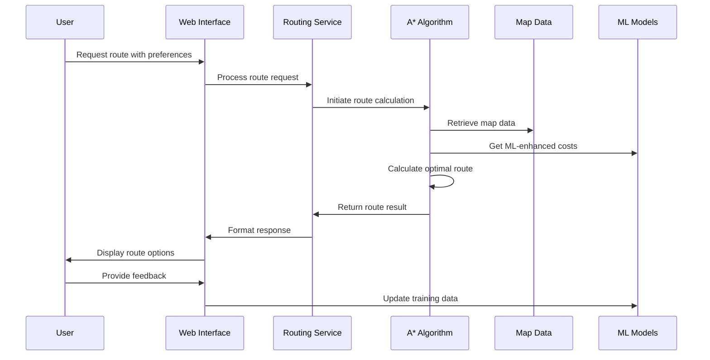

# System Architecture for Accessible Route Planning System

## Overview

This document describes the architecture of the Accessible Route Planning System for Differently Abled and Elderly Citizens Using OpenStreetMap and A* Search Algorithm.

## High-Level Architecture

## Component Details

### 1. User Interface Layer
- Web-based interface using HTML/CSS/JavaScript
- Mobile-responsive design
- Accessibility-focused UI components
- Interactive map visualization
- Route planning forms and controls

### 2. Web Application Layer
- Flask-based web framework
- RESTful API endpoints
- Authentication and authorization
- Session management
- Request/response handling

### 3. Routing Service
- Route planning orchestration
- User profile integration
- Multi-criteria route optimization
- Real-time obstacle integration
- Route result formatting

### 4. A* Algorithm Engine
- Core pathfinding implementation
- Multi-criteria cost functions
- Accessibility constraint filtering
- Personalized routing based on user profiles
- Performance optimization

### 5. Map Data Store
- Graph representation of map data
- Node and edge attributes
- Accessibility information
- Real-time updates from community feedback
- Spatial indexing for performance

### 6. ML Enhancement Layer
- Heuristic learning from historical data
- Dynamic cost function prediction
- Personalized route recommendations
- Model training and evaluation
- Feedback-driven model updates

### 7. OSM Data Processor
- OpenStreetMap data downloading
- Accessibility attribute extraction
- Data validation and cleaning
- Graph construction and optimization
- Regular data updates

### 8. User Management
- User registration and authentication
- Profile management
- Preference configuration
- Privacy and security controls

### 9. Feedback System
- Obstacle reporting
- Route feedback collection
- Community verification
- Data quality improvement

## Data Flow

## Technology Stack

### Backend
- Python 3.8+
- Flask web framework
- NetworkX for graph processing
- Scikit-learn for machine learning
- SQLite/PostgreSQL for data storage
- OSMnx for OpenStreetMap integration

### Frontend
- HTML5, CSS3, JavaScript
- Bootstrap for responsive design
- Leaflet.js for map visualization
- AJAX for asynchronous requests

### Infrastructure
- Virtual environment for isolation
- Git for version control
- Docker for containerization (optional)
- CI/CD pipeline (optional)

## Security Considerations

- User authentication and authorization
- Data encryption for sensitive information
- Secure API endpoints
- Input validation and sanitization
- Privacy controls for user data

## Scalability Features

- Modular architecture for easy extension
- Caching mechanisms for performance
- Database indexing for query optimization
- Asynchronous processing for heavy computations
- Load balancing support